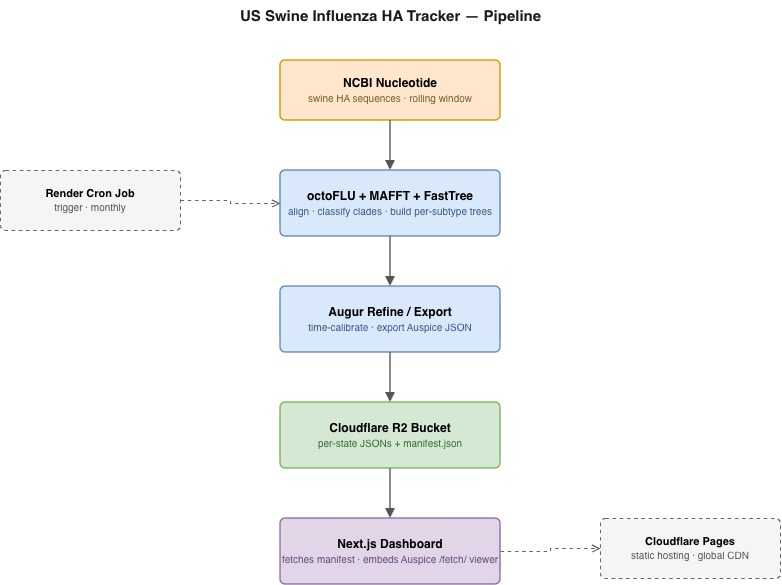

# 🐖 US Swine Influenza HA Tracker

An automated, end-to-end surveillance pipeline for U.S. swine influenza A virus (IAV) hemagglutinin (HA) sequences — from NCBI to interactive phylogenetics in the browser.

---

## Motivation

Swine influenza A virus is one of the most economically significant respiratory pathogens in the U.S. pork industry. It evolves rapidly, reassorts frequently, and circulates in a complex ecosystem that spans multiple H1 and H3 lineages. Public health and veterinary researchers need to see, at a glance, **which clades are circulating where, when they emerged, and how they're moving** — but pulling that picture together today requires manual downloads, command-line bioinformatics tools, and stitching together several disconnected systems.

This project automates that entire workflow into a single pipeline that runs on a schedule, publishes results to cloud storage, and serves a live interactive dashboard. It is built primarily for the **top swine-producing U.S. states** (Iowa, Minnesota, North Carolina, Illinois, Indiana, Nebraska, Missouri, Ohio, Kansas, Oklahoma, and Texas), but the state list is configurable.

The goal is simple: make U.S. swine IAV surveillance data **accessible, explorable, and always up to date** without requiring a bioinformatics workstation.

---

## How It Works

The backend runs on a **monthly scheduled cron job** (Render), and the frontend is a **static Next.js site** hosted on Cloudflare Pages.

---

## Tools & Technologies

This project is a mix of mature, well-maintained tools
### Bioinformatics

| Tool | Purpose |
|---|---|
| **[octoFLU](https://github.com/flu-crew/octoFLU)** | Automated clade classification of swine IAV HA sequences |
| **[MAFFT](https://mafft.cbrc.jp/alignment/software/)** | Multiple sequence alignment (via octoFLU) |
| **[FastTree](http://www.microbesonline.org/fasttree/)** | Approximate maximum-likelihood phylogenetic trees |
| **[Augur](https://docs.nextstrain.org/projects/augur/)** | Tree refinement, time calibration, Auspice JSON export |
| **[TreeTime](https://github.com/neherlab/treetime)** | Molecular clock inference (via Augur) |
| **[Biopython](https://biopython.org/)** | NCBI Entrez queries and GenBank parsing |

### Data & Infrastructure

| Tool | Purpose |
|---|---|
| **[NCBI Nucleotide](https://www.ncbi.nlm.nih.gov/nuccore/)** | Source of swine HA sequences |
| **[Cloudflare R2](https://developers.cloudflare.com/r2/)** | Object storage for Auspice JSONs and manifest |
| **[Render](https://render.com/)** | Scheduled Docker cron job for the pipeline |
| **[Docker](https://www.docker.com/)** | Reproducible container for the bioinformatics stack |

### Frontend

| Tool | Purpose |
|---|---|
| **[Next.js 16](https://nextjs.org/)** | React framework (static export) |
| **[Nextstrain / Auspice](https://nextstrain.org/)** | Interactive phylogenetic visualization |
| **[Tailwind CSS](https://tailwindcss.com/)** | Dashboard styling |
| **[Cloudflare Pages](https://pages.cloudflare.com/)** | Free static hosting with global CDN |

---

## Features

### Data Pipeline

- **Automated NCBI fetch** — pulls recent swine HA sequences per state, filtered by host, location, and date
- **Clade classification** — runs octoFLU to assign real H1/H3 clade names (`1B.2.1`, `1990.4.i`, `1A.3.3.3-c3`, etc.)
- **Per-state, per-subtype trees** — H1 and H3 are processed independently for cleaner phylogenies
- **Time-calibrated** — collection dates parsed into ISO, year, and month fields for Auspice's time slider
- **Manifest generation** — one `manifest.json` reports which states have data and their available date ranges

### Interactive Dashboard

- **State selector** — driven by the live manifest, so only states with data appear
- **H1 / H3 toggle** — switches between subtypes without reloading the page
- **Color by** — Clade, Lineage, Collection Year, or Collection Month
- **Filter** — multi-select filters for Clade, Lineage, Year, and Month (stackable)
- **Time slider** — drag across the temporal axis to focus on any window
- **Nextstrain-powered** — uses the official Auspice viewer via the `/fetch/` API, so no local tree rendering needed

---

## Data Content

All sequences are fetched live from **[NCBI Nucleotide](https://www.ncbi.nlm.nih.gov/nuccore/)** at pipeline runtime. No sequence data is bundled with this repository.

- **Host filter:** swine
- **Target gene:** hemagglutinin (HA)
- **Geographic filter:** U.S. state-level location tags
- **Window:** rolling ~3-year window (configurable via `--days`)
- **Metadata columns:** strain name, collection date, year, month, state, clade, lineage
- **Clade assignment:** derived from octoFLU's neural-network classifier against its curated reference panel

Sequence availability varies by state and by submission activity to GenBank. Some states may have sparse data; the dashboard only lists states that returned at least one usable record for a given subtype.

This is a **surveillance and visualization tool**, not a diagnostic or clinical decision-making resource.

---

## Contributing

Pull requests are welcome. If you're adding a new state, adjusting the clade parsing logic, or extending the dashboard, please include:

- A short description of the change and why it's needed
- A sample pipeline run log
- A snippet of the resulting `metadata_<state>.tsv` (first 3–5 rows)

For larger changes, please open an issue first to discuss the approach before writing code.

---

## License

MIT © 2026 **Faith (propenster) Olusegun**

---
